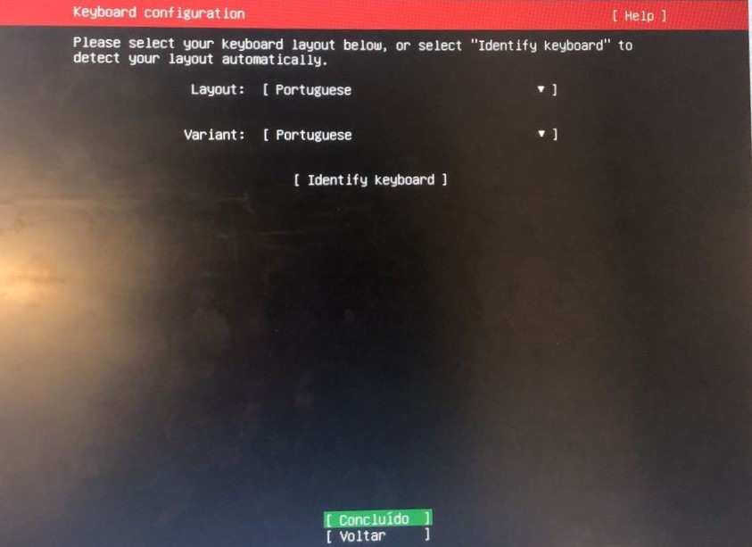

# selecao_estagio
Repositório para seleção de estágio.

## Atividades Realizadas

### Criação da Máquina Virtual

### Instalação do sistema operacional

Para instalar o sistema, os seguintes passos foram seguidos:

- Primeiro escolha o idioma a ser utilizado:

- Em seguida escolha o layout de teclado

## Máquina virtual
O arquivo da máquina virtual poderá ser acessada a partir do seguinte  [link](https://drive.google.com/file/d/1c9MjhHYSaaR2yKtIceQmxWaKATE6kTLn/view?usp=sharing)
