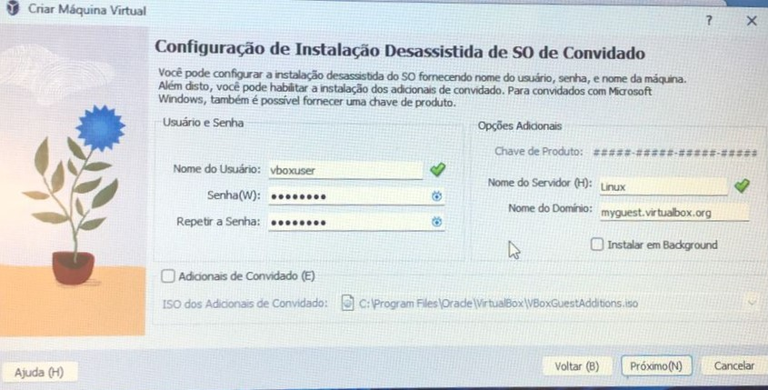

# selecao_estagio
Repositório para seleção de estágio.

## Atividades Realizadas

### Criação da Máquina Virtual

Para a criação foram seguidos os seguintes passos:

- Clicando em NOVO

- Nomeando a máquina virtual

- Configurando a instalação desassistida do SO fornecendo nome de usuário, senha e nome da máquina.

- Especificando o tamanho da memória e do processador, colocando a memória em 1024 e o processador em 1.

- Especificando o tamanho do disco rígido, colocando com 10GB.

### Instalação do sistema operacional

Para instalar o sistema, os seguintes passos foram seguidos:

- Primeiro escolha o idioma a ser utilizado:

- Opçoes de uma atualização mais recente

- Em seguida escolha o layout de teclado

- Escolhendo o tipo de instalação

- Configurando uma interface de rede

- Configurando proxy

- Confirando Ubuntu archive mirror

- Configurando um layout de armazenamento guiado ou criando um personalizado, adicionei a opção de usar um disco inteiro.

- Resumo do sistema de arquivos

- Definindo o perfil.

- Opção para atualizar para o Ubuntu Pro

- Configurando SSH

- Instalando o sistema

- Htop

- Df

## Máquina virtual
O arquivo da máquina virtual poderá ser acessada a partir do seguinte  [link](https://drive.google.com/file/d/1c9MjhHYSaaR2yKtIceQmxWaKATE6kTLn/view?usp=sharing)
